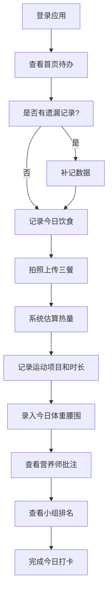
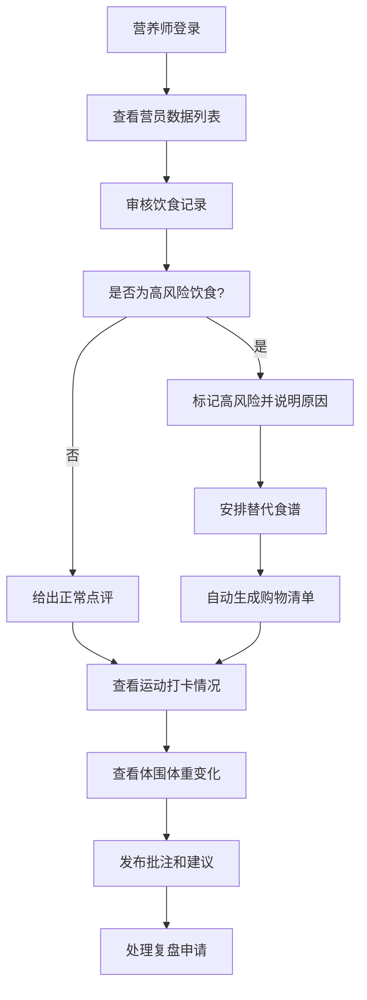

## 1. 产品概述

社区减重营健康管理Web应用，面向减重营营员和营养师，提供饮食运动跟踪、数据记录、专业指导和社区互动的一体化健康管理平台。通过科学的数据记录和营养师的专业指导，帮助营员达成减重目标，建立健康生活习惯。

### 核心价值
- 为营员：提供便捷的健康数据记录工具，可视化进度追踪，专业营养师指导
- 为营养师：高效管理多组营员，精准识别高风险行为，提供个性化指导
- 为社区：通过小组榜单增强互动性和归属感，营造积极减重氛围

---

## 2. 核心功能

### 2.1 用户角色

| 角色 | 登录方式 | 核心权限 |
|------|----------|----------|
| 营员 | 账号密码登录 | 记录饮食、运动、体围体重数据，查看个人报告，申请复盘，查看小组排名 |
| 营养师 | 账号密码登录 | 查看所有营员数据，批注点评，标记高风险，安排替代食谱，发布通知 |

### 2.2 功能模块

1. **营员首页**：个人数据概览、今日待办、连续打卡、平台通知
2. **饮食记录**：拍照记录三餐、热量估算、高风险标记、替代食谱、购物清单
3. **运动打卡**：登记运动项目、时长记录、卡路里消耗、连续打卡统计
4. **体围体重**：体重腰围录入、数据曲线、阶段目标设置、体重隐私保护
5. **营养师批注**：营养师留言点评、高风险饮食标记、个性化建议
6. **小组榜单**：按小组排名、多维度排行、隐藏具体体重数据
7. **报告中心**：周报告生成、数据回顾、一对一复盘申请

### 2.3 页面详情

| 页面名称 | 模块名称 | 功能描述 |
|---------|----------|----------|
| 营员首页 | 数据概览卡片 | 显示今日饮食、运动、体重完成情况 |
| 营员首页 | 待办提醒 | 提醒补记遗漏数据、待处理事项 |
| 营员首页 | 连续打卡 | 显示连续打卡天数、打卡日历 |
| 营员首页 | 平台通知 | 查看营养师留言、系统公告 |
| 饮食记录 | 三餐记录 | 拍照上传早中晚餐，支持备注 |
| 饮食记录 | 热量估算 | 根据食物类型估算热量区间 |
| 饮食记录 | 高风险标记 | 营养师标记不健康饮食并标注原因 |
| 饮食记录 | 替代食谱 | 营养师为高风险饮食安排健康替代方案 |
| 饮食记录 | 购物清单 | 根据推荐食谱自动生成购物清单 |
| 运动打卡 | 项目登记 | 选择运动类型（跑步、游泳、瑜伽等） |
| 运动打卡 | 时长记录 | 记录运动时长，自动计算消耗卡路里 |
| 运动打卡 | 打卡统计 | 连续打卡天数、本周运动总时长 |
| 体围体重 | 数据录入 | 录入体重、腰围、臀围等数据 |
| 体围体重 | 趋势曲线 | 体重腰围变化趋势图 |
| 体围体重 | 阶段目标 | 设置减重目标、目标日期 |
| 体围体重 | 隐私保护 | 支持隐藏具体体重数值，仅显示变化趋势 |
| 营养师批注 | 留言列表 | 按时间线显示营养师批注 |
| 营养师批注 | 风险标记 | 高风险饮食红色醒目标记 |
| 营养师批注 | 建议回复 | 营员可回复营养师建议 |
| 小组榜单 | 排名列表 | 按减重百分比、打卡率等多维度排名 |
| 小组榜单 | 小组切换 | 切换查看不同小组排名 |
| 小组榜单 | 隐私保护 | 隐藏具体体重，仅显示排名和变化百分比 |
| 报告中心 | 周报告 | 自动生成每周健康报告，包含数据总结和建议 |
| 报告中心 | 复盘申请 | 申请与营养师一对一视频/语音复盘 |
| 报告中心 | 历史报告 | 查看历史周报告和复盘记录 |

---

## 3. 核心流程

### 3.1 营员每日健康记录流程

### 3.2 营养师工作流程

---

## 4. 用户界面设计

### 4.1 设计风格

**整体调性：清新健康、专业可信、温暖鼓励**

- **主色调**：清新薄荷绿 (#10B981) - 代表健康、活力、自然
- **辅助色**：活力珊瑚橙 (#F97316) - 代表能量、热情、行动力
- **中性色**：温润灰 (#64748B) - 专业、稳重
- **背景色**：奶油白 (#FAFAF9) - 温暖、舒适

**字体选择**：
- 标题字体：Noto Sans SC Bold - 清晰有力
- 正文字体：Noto Sans SC Regular - 舒适易读
- 数据字体：JetBrains Mono - 数字清晰对齐

**按钮风格**：
- 圆角 12px，柔和的阴影效果
- 主按钮：薄荷绿渐变，悬停时有轻微上浮效果
- 次要按钮：描边样式，悬停时背景填充

**布局风格**：
- 顶部导航 + 侧边菜单 + 内容区域三栏布局
- 卡片式信息展示，卡片之间有呼吸空间
- 数据可视化采用圆润的图表风格

**图标风格**：
- 使用 Lucide 图标库，线性风格
- 关键功能使用填充色图标增强辨识度
- 适当使用 emoji 增添亲和力（🍎🏃‍♀️📊）

### 4.2 页面设计概述

| 页面名称 | 模块名称 | UI 元素 |
|---------|----------|---------|
| 营员首页 | 数据概览 | 渐变卡片、圆环进度图、数据卡片网格、微动画入场 |
| 营员首页 | 待办提醒 | 橙色警示标签、时间倒计时、一键跳转补录 |
| 营员首页 | 连续打卡 | 日历热力图、连续天数徽章、成就动效 |
| 饮食记录 | 三餐记录 | 照片上传区、时间线布局、餐次卡片 |
| 饮食记录 | 热量估算 | 区间滑块、热量标签、食物识别占位 |
| 饮食记录 | 高风险标记 | 红色边框高亮、警告图标、原因标签 |
| 运动打卡 | 项目登记 | 运动类型图标网格、时长滑块、卡路里实时计算 |
| 运动打卡 | 打卡统计 | 火焰连续打卡图标、数据趋势折线图 |
| 体围体重 | 数据录入 | 数字输入框、单位切换、隐私开关 |
| 体围体重 | 趋势曲线 | 平滑面积图、目标线标记、数据点悬停详情 |
| 营养师批注 | 留言列表 | 聊天气泡样式、营养师头像标识、时间戳 |
| 小组榜单 | 排名列表 | 奖牌图标（金/银/铜）、排名变化箭头、模糊处理体重 |
| 报告中心 | 周报告 | PDF 样式卡片、数据可视化图表、下载按钮 |
| 报告中心 | 复盘申请 | 时间选择器、视频/语音选项、申请状态标签 |

### 4.3 响应式设计

- **桌面端优先**：1440px 基准设计，最大宽度 1920px
- **平板适配**：1024px 时侧边菜单收起为图标模式
- **手机适配**：768px 时改为底部导航栏，卡片单列布局
- **触摸优化**：按钮最小尺寸 44x44px，支持滑动操作

### 4.4 动效与交互

- **页面入场**：内容区域淡入 + 轻微上移，卡片依次延迟出现
- **数据更新**：数字变化时使用滚动数字动效
- **打卡成功**：庆祝动画（彩屑效果 + 徽章弹出）
- **悬停反馈**：卡片悬停时轻微上浮 + 阴影加深
- **加载状态**：骨架屏 + 脉冲动画

---

## 5. 数据安全与隐私

### 5.1 体重隐私保护
- 营员可选择"隐藏体重"模式，仅显示变化趋势和百分比
- 小组榜单中默认不显示具体体重数值
- 营养师查看数据需营员授权（或根据营规）

### 5.2 数据安全
- 所有健康数据加密存储
- 照片上传自动压缩并添加隐私保护
- 定期数据备份和安全审计
