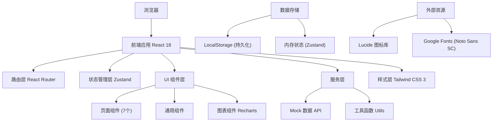
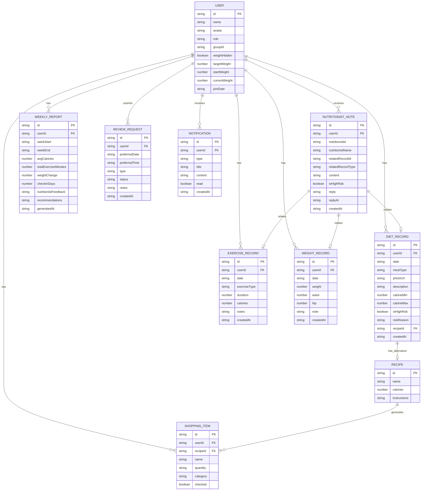

## 1. 架构设计



---

## 2. 技术描述

### 2.1 技术栈选型

| 层级 | 技术选型 | 版本 | 用途说明 |
|------|----------|------|----------|
| 前端框架 | React | 18.x | 组件化开发，支持 Hooks |
| 开发语言 | TypeScript | 5.x | 类型安全，提升代码质量 |
| 构建工具 | Vite | 5.x | 快速开发构建，热更新 |
| 样式方案 | Tailwind CSS | 3.x | 原子化 CSS，快速开发 |
| 路由管理 | React Router DOM | 6.x | 单页应用路由 |
| 状态管理 | Zustand | 4.x | 轻量级状态管理 |
| 图表库 | Recharts | 2.x | 数据可视化图表 |
| 图标库 | Lucide React | 0.400.x | 线性风格图标 |
| 日期处理 | date-fns | 3.x | 日期格式化和计算 |
| 后端服务 | Express | 4.x | 可选，用于提供 API 服务 |
| 数据库 | SQLite（可选） | - | 持久化存储用户数据 |

### 2.2 项目初始化

- **初始化工具**：vite-init
- **项目模板**：react-ts (React + TypeScript，纯前端)
- **包管理器**：npm (Windows 环境)
- **数据方案**：前端 Mock 数据 + LocalStorage 持久化

---

## 3. 路由定义

| 路由路径 | 页面名称 | 组件文件 | 说明 |
|----------|----------|----------|------|
| `/` | 营员首页 | `src/pages/Dashboard.tsx` | 数据概览、待办提醒、连续打卡 |
| `/diet` | 饮食记录 | `src/pages/DietRecord.tsx` | 三餐记录、热量估算、高风险标记 |
| `/exercise` | 运动打卡 | `src/pages/Exercise.tsx` | 运动项目登记、时长记录 |
| `/body` | 体围体重 | `src/pages/BodyStats.tsx` | 体重腰围录入、趋势曲线 |
| `/nutritionist` | 营养师批注 | `src/pages/NutritionistNotes.tsx` | 批注列表、回复功能 |
| `/leaderboard` | 小组榜单 | `src/pages/Leaderboard.tsx` | 小组排名、多维度排行 |
| `/reports` | 报告中心 | `src/pages/Reports.tsx` | 周报告、复盘申请 |

---

## 4. API 定义（前端 Mock）

### 4.1 类型定义

```typescript
// 用户信息
interface User {
  id: string;
  name: string;
  avatar: string;
  role: 'member' | 'nutritionist';
  groupId: string;
  weightHidden: boolean;
  targetWeight: number;
  startWeight: number;
  currentWeight: number;
  joinDate: string;
}

// 饮食记录
interface DietRecord {
  id: string;
  userId: string;
  date: string;
  mealType: 'breakfast' | 'lunch' | 'dinner' | 'snack';
  photoUrl: string;
  description: string;
  calorieRange: [number, number];
  isHighRisk: boolean;
  riskReason?: string;
  alternativeRecipe?: Recipe;
  createdAt: string;
}

// 运动记录
interface ExerciseRecord {
  id: string;
  userId: string;
  date: string;
  exerciseType: string;
  duration: number; // minutes
  calories: number;
  notes: string;
  createdAt: string;
}

// 体重记录
interface WeightRecord {
  id: string;
  userId: string;
  date: string;
  weight: number;
  waist?: number;
  hip?: number;
  note?: string;
  createdAt: string;
}

// 营养师批注
interface NutritionistNote {
  id: string;
  userId: string;
  nutritionistId: string;
  nutritionistName: string;
  relatedRecordId?: string;
  relatedRecordType?: 'diet' | 'exercise' | 'weight';
  content: string;
  isHighRisk: boolean;
  createdAt: string;
  reply?: string;
  replyAt?: string;
}

// 食谱
interface Recipe {
  id: string;
  name: string;
  ingredients: { name: string; amount: string }[];
  calories: number;
  instructions: string;
}

// 购物清单项
interface ShoppingItem {
  id: string;
  name: string;
  quantity: string;
  category: string;
  checked: boolean;
}

// 小组成员排名
interface GroupRanking {
  userId: string;
  userName: string;
  avatar: string;
  rank: number;
  weightLossPercent: number;
  checkInRate: number;
  exerciseMinutes: number;
  lastWeekChange: number;
}

// 周报告
interface WeeklyReport {
  id: string;
  userId: string;
  weekStart: string;
  weekEnd: string;
  summary: {
    avgCalories: number;
    totalExerciseMinutes: number;
    weightChange: number;
    checkInDays: number;
  };
  nutritionistFeedback: string;
  recommendations: string[];
  generatedAt: string;
}

// 复盘申请
interface ReviewRequest {
  id: string;
  userId: string;
  preferredDate: string;
  preferredTime: string;
  type: 'video' | 'voice';
  status: 'pending' | 'approved' | 'rejected' | 'completed';
  notes: string;
  createdAt: string;
}

// 通知
interface Notification {
  id: string;
  userId: string;
  type: 'note' | 'high_risk' | 'report' | 'system';
  title: string;
  content: string;
  read: boolean;
  createdAt: string;
}
```

### 4.2 Mock API 接口

| 接口方法 | 接口路径 | 功能说明 |
|----------|----------|----------|
| `getUserProfile()` | - | 获取当前用户信息 |
| `updateUserProfile(data)` | - | 更新用户信息 |
| `getDietRecords(date?)` | - | 获取饮食记录列表 |
| `addDietRecord(data)` | - | 添加饮食记录 |
| `getExerciseRecords(date?)` | - | 获取运动记录 |
| `addExerciseRecord(data)` | - | 添加运动记录 |
| `getWeightRecords()` | - | 获取体重记录 |
| `addWeightRecord(data)` | - | 添加体重记录 |
| `getNutritionistNotes()` | - | 获取营养师批注 |
| `replyToNote(noteId, content)` | - | 回复批注 |
| `getGroupRanking(groupId)` | - | 获取小组排名 |
| `getWeeklyReports()` | - | 获取周报告列表 |
| `createReviewRequest(data)` | - | 申请复盘 |
| `getNotifications()` | - | 获取通知列表 |
| `getShoppingList()` | - | 获取购物清单 |
| `toggleShoppingItem(id)` | - | 切换购物清单项状态 |

---

## 5. 数据模型

### 5.1 ER 图



### 5.2 数据初始化 (Mock Data)

```typescript
// 初始Mock数据
const mockUser: User = {
  id: 'user-001',
  name: '李小美',
  avatar: 'https://api.dicebear.com/7.x/avataaars/svg?seed=xiaomei',
  role: 'member',
  groupId: 'group-01',
  weightHidden: false,
  targetWeight: 55,
  startWeight: 70,
  currentWeight: 65.5,
  joinDate: '2026-03-01',
};

const mockDietRecords: DietRecord[] = [
  {
    id: 'diet-001',
    userId: 'user-001',
    date: '2026-06-10',
    mealType: 'breakfast',
    photoUrl: '',
    description: '燕麦粥 + 水煮蛋 + 小番茄',
    calorieRange: [320, 380],
    isHighRisk: false,
    createdAt: '2026-06-10T08:00:00',
  },
  // ... 更多示例数据
];

const mockExerciseTypes = [
  { id: 'running', name: '跑步', icon: '🏃‍♀️', caloriesPerMin: 10 },
  { id: 'swimming', name: '游泳', icon: '🏊‍♀️', caloriesPerMin: 12 },
  { id: 'yoga', name: '瑜伽', icon: '🧘‍♀️', caloriesPerMin: 4 },
  { id: 'cycling', name: '骑行', icon: '🚴‍♀️', caloriesPerMin: 8 },
  { id: 'walking', name: '快走', icon: '🚶‍♀️', caloriesPerMin: 5 },
  { id: 'strength', name: '力量训练', icon: '🏋️‍♀️', caloriesPerMin: 7 },
  { id: 'dance', name: '跳舞', icon: '💃', caloriesPerMin: 8 },
  { id: 'hiit', name: 'HIIT', icon: '🔥', caloriesPerMin: 14 },
];
```

---

## 6. 项目结构

```
├── src/
│   ├── components/          # 通用组件
│   │   ├── Layout.tsx       # 布局组件（侧边栏+内容区）
│   │   ├── Sidebar.tsx      # 侧边导航栏
│   │   ├── Navbar.tsx       # 顶部导航栏
│   │   ├── StatCard.tsx     # 数据统计卡片
│   │   ├── ProgressRing.tsx # 圆环进度组件
│   │   ├── Calendar.tsx     # 打卡日历组件
│   │   └── NotificationBadge.tsx
│   ├── pages/               # 页面组件
│   │   ├── Dashboard.tsx    # 营员首页
│   │   ├── DietRecord.tsx   # 饮食记录
│   │   ├── Exercise.tsx     # 运动打卡
│   │   ├── BodyStats.tsx    # 体围体重
│   │   ├── NutritionistNotes.tsx  # 营养师批注
│   │   ├── Leaderboard.tsx  # 小组榜单
│   │   └── Reports.tsx      # 报告中心
│   ├── store/               # 状态管理
│   │   ├── useUserStore.ts  # 用户状态
│   │   ├── useDietStore.ts  # 饮食记录状态
│   │   ├── useExerciseStore.ts
│   │   ├── useBodyStore.ts
│   │   ├── useNoteStore.ts
│   │   └── useNotificationStore.ts
│   ├── types/               # TypeScript 类型定义
│   │   └── index.ts
│   ├── utils/               # 工具函数
│   │   ├── date.ts          # 日期处理
│   │   ├── calories.ts      # 热量计算
│   │   └── storage.ts       # LocalStorage 封装
│   ├── mock/                # Mock 数据
│   │   ├── data.ts
│   │   └── api.ts
│   ├── App.tsx              # 根组件
│   ├── main.tsx             # 入口文件
│   └── index.css            # 全局样式
├── .trae/
│   └── documents/           # 项目文档
├── package.json
├── tsconfig.json
├── vite.config.ts
├── tailwind.config.js
└── postcss.config.js
```

---

## 7. 开发规范

### 7.1 代码规范
- 使用 TypeScript 严格模式
- 组件使用函数式组件 + Hooks
- 每个组件不超过 300 行，超过需拆分
- 使用 ESLint + Prettier 代码格式化
- 导入路径使用 `@/` 别名

### 7.2 命名规范
- 组件：PascalCase (e.g., `DietRecordCard`)
- 函数/变量：camelCase (e.g., `calculateCalories`)
- 类型/接口：PascalCase，接口以 `I` 开头可选
- 常量：UPPER_SNAKE_CASE (e.g., `MAX_CALORIES_PER_DAY`)

### 7.3 状态管理
- 使用 Zustand 管理全局状态
- 页面级状态使用 React `useState`
- 表单状态使用 React `useState` 管理
- LocalStorage 用于数据持久化

### 7.4 样式规范
- 优先使用 Tailwind 原子类
- 复杂样式使用 `@apply` 提取
- 自定义颜色在 `tailwind.config.js` 中定义
- 使用 CSS 变量管理主题色
